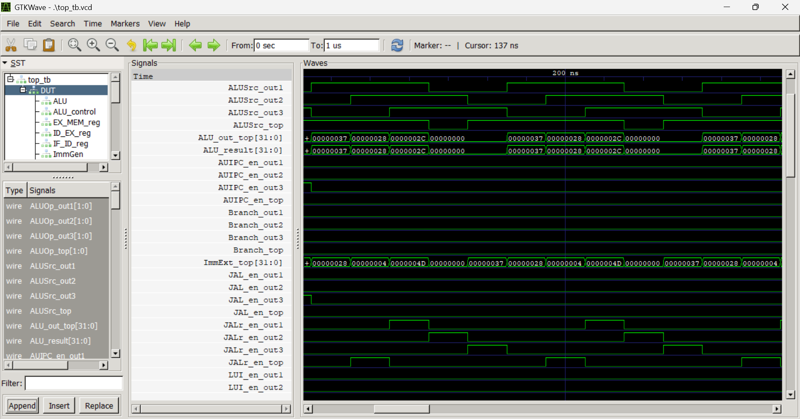
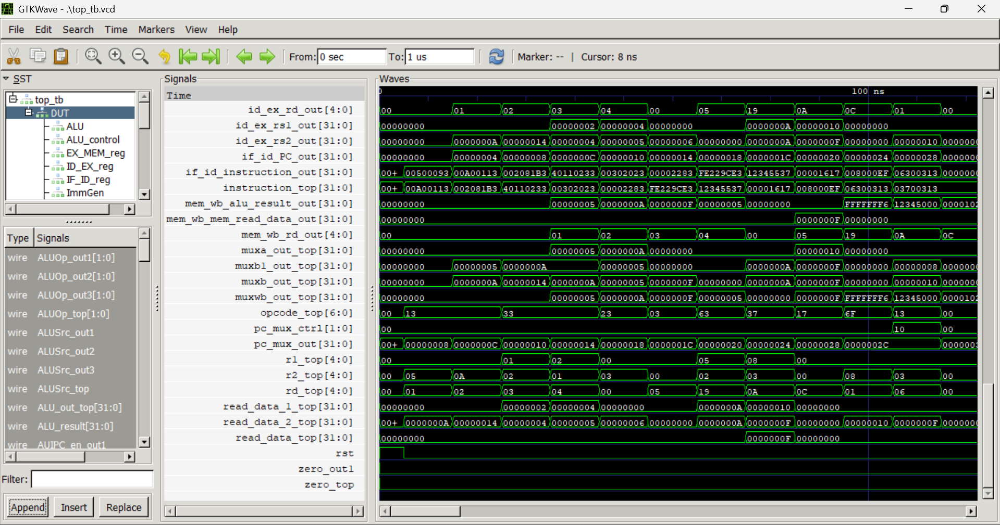

# **RISC-V 32×32 Fully Pipelined CPU (RV32I)**

A synthesizable, modular **5-stage pipelined RISC-V RV32I CPU**, designed in Verilog.
The CPU implements a standard 32-register × 32-bit architecture, supports forwarding, hazard detection, branch flushing, and includes a complete simulation environment with waveforms.

This repository is intended both as a **learning reference** and a **solid base architecture** for extending into advanced RISC-V features such as branch prediction, M-extension, caches, or CSR support.

---

## 📂 **Repository Structure**

```
.
├── Src/
│   ├── top.v                     — CPU top-level integration
│   ├── top_tb.v                  — Testbench (produces VCD)
│   ├── instruction_mem.v         — Instruction memory (hex-loaded)
│   ├── data_mem.v                — Byte-addressable data memory
│   ├── program_counter.v         — PC register
│   ├── PC_inc.v                  — PC + 4 logic
│   ├── PC_mux.v                  — PC selection (branch/jump)
│   ├── IF_ID_reg.v               — IF/ID pipeline register
│   ├── ID_EX_reg.v               — ID/EX pipeline register
│   ├── EX_MEM_reg.v              — EX/MEM pipeline register
│   ├── MEM_WB_reg.v              — MEM/WB pipeline register
│   ├── reg_file.v                — 32×32 register file
│   ├── ALU.v, ALU_control.v      — Arithmetic and logic execution
│   ├── imm_gen.v                 — Immediate generator (I/S/B/U/J)
│   ├── inst_parser.v             — Instruction field extractor
│   ├── control_unit.v            — Opcode → control signal mapping
│   ├── forwarding_unit.v         — Forwarding logic (RAW hazard fix)
│   ├── gatelogic.v               — Hazard detection (load-use stall)
│   ├── branch_calc_adder.v       — Branch target computation
│   ├── mux_a.v, mux_b.v, ...     — ALU + PC muxes
│   ├── top_tb.vcd                — Example waveform dump
│   └── *.vvp                     — Icarus compiled simulation output
│
├── hex/                          — Instruction memory hex programs
├── images/                       — Diagrams & architecture visuals
├── waveform/                     — Saved pipeline waveforms
└── README.md
```

---

# 🧠 **Architectural Overview**

### **Pipeline Stages**

A classical **5-stage RISC pipeline**:

| Stage | Name                 | Description                                 |
| ----- | -------------------- | ------------------------------------------- |
| IF    | Instruction Fetch    | PC update, instruction memory read          |
| ID    | Decode/Register Read | Control decode, regfile read, immediate gen |
| EX    | Execute              | ALU ops, branch calculation, forwarding     |
| MEM   | Memory               | Load/store unit                             |
| WB    | Writeback            | Write result to register file               |

---

## ⚙️ **Core Features**

### **✔ RV32I Instruction Set**

Supports all core RV32I instructions:

* **R-type**: ADD, SUB, AND, OR, XOR, SLL, SRL, SRA, SLT, SLTU
* **I-type**: ADDI, ANDI, ORI, XORI, SLTI, SLLI, SRLI, SRAI
* **Loads**: LB, LH, LW, LBU, LHU
* **Stores**: SB, SH, SW
* **Branches**: BEQ, BNE, BLT, BLTU, BGE, BGEU
* **Jumps**: JAL, JALR
* **Upper immediates**: LUI, AUIPC

---

## 🧵 **Hazard Handling**

### **1️⃣ Forwarding (bypassing)**

The **forwarding_unit.v** detects dependencies between:

* EX stage sources (`rs1`, `rs2`)
* Destination registers in EX/MEM or MEM/WB stages

It selects forwarded operands via ALU input multiplexers, removing stalls for most RAW hazards.

---

### **2️⃣ Load-Use Hazard Detection**

The **gatelogic.v** module detects:

```
ID instruction uses a register 
that EX instruction is loading → stall pipeline
```

Action:

* Freeze PC and IF/ID
* Insert **one bubble** into ID/EX

Perfectly matches textbook pipeline behaviour.

---

### **3️⃣ Branch Handling & Pipeline Flush**

Branches and jumps are resolved in EX.
If taken:

* IF/ID and ID/EX are flushed
* PC is redirected to branch/jump target
* At most **two instructions** are discarded (standard RISC-V behaviour)

---

# 🖥 **Datapath Visualization**

### 📊 **Waveform Example 1**

```

```

### 📊 **Waveform Example 2**

```

```

### 📊 **Waveform Example 3**

```

```

---

# 🧪 **Simulation Guide**

### **Using Icarus Verilog**

From repository root:

```bash
iverilog -g2012 -o cpu.vvp Src/*.v
vvp cpu.vvp
```

This produces:

```
Src/top_tb.vcd
```

To view waveforms:

```bash
gtkwave Src/top_tb.vcd
```

---

# 📘 **How Key Modules Work**

### **ALU & ALU Control**

* ALU operations selected using `{ALUOp, funct7, funct3}`
* Supports arithmetic shift, logical shift, comparisons, logical ops, add/sub

### **Immediate Generator**

Generates sign-extended immediates for:

* I
* S
* B
* U
* J formats

Matches the RISC-V spec bit-fields exactly.

### **Control Unit**

Decodes opcode and produces:

* RegWrite
* MemRead / MemWrite
* MemToReg
* ALUSrc
* Branch
* JAL / JALR
* ALUOp signals

### **Pipeline Registers**

Each stage contains:

* Operand values
* Control signals
* ALU results
* Memory addresses/data

With support for:

* Stall
* Flush
* Bubble insertions

---

# 🔍 **Verification Strategy**

Recommended tests:

### **1. ALU Tests**

Ensure ADD/SUB/AND/OR/XOR/SLT/SRL/SRA/SLL behave correctly.

### **2. Forwarding Tests**

```
add x1, x2, x3
add x4, x1, x5     ← must forward
```

### **3. Load-Use Stall Test**

```
lw  x1, 0(x2)
add x3, x1, x4     ← must stall 1 cycle
```

### **4. Branch Tests**

* Both taken and not-taken cases
* Confirm flush behaviour

### **5. Memory Tests**

* Byte / halfword / word loads
* Signed & unsigned variants

### **6. Full Program Execution**

Use hex files in `/hex/` directory.

---

# 📈 **Extensibility Roadmap**

You can evolve this CPU into:

* ✔ Simple **static branch prediction** (1-bit or 2-bit)
* ✔ M-extension (MUL, DIV, REM)
* ✔ Interrupts & CSRs (RV32IMC)
* ✔ Pipeline visualization tooling
* ✔ Instruction/Data cache hierarchy
* ✔ Single-cycle memory interface for FPGA implementation

---

# 🤝 **Contributing**

Pull requests are welcome—add tests, improve hazard logic, add instructions, or include better diagrams.

Issues can include:

* A failing sequence
* A misdecoded instruction
* Suggestions for new features

---
---

# 🧩 **Appendix: Key Files to Inspect**

| Feature                | File                                       |
| ---------------------- | ------------------------------------------ |
| ALU ops                | `ALU_control.v`, `ALU.v`                   |
| Forwarding rules       | `forwarding_unit.v`                        |
| Load-use stall         | `gatelogic.v`                              |
| Branch handling        | `top.v`, `branch_calc_adder.v`, `PC_mux.v` |
| Instruction decode     | `control_unit.v`                           |
| Immediate format logic | `imm_gen.v`                                |
| Pipeline integration   | `top.v`                                    |

---
Built by:
Jeevanandh R
VLSI | RTL engineer |
